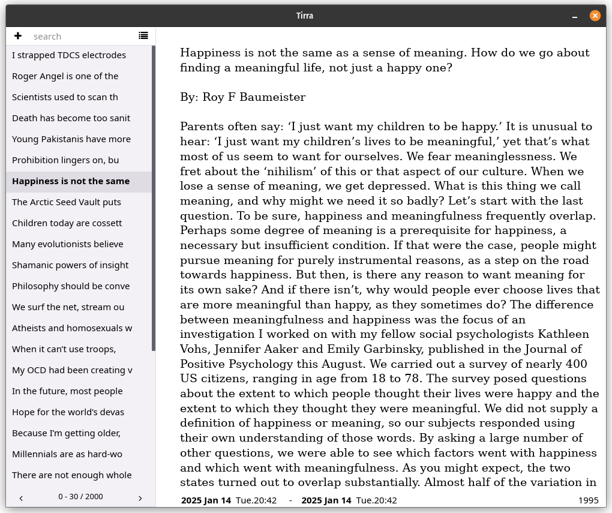
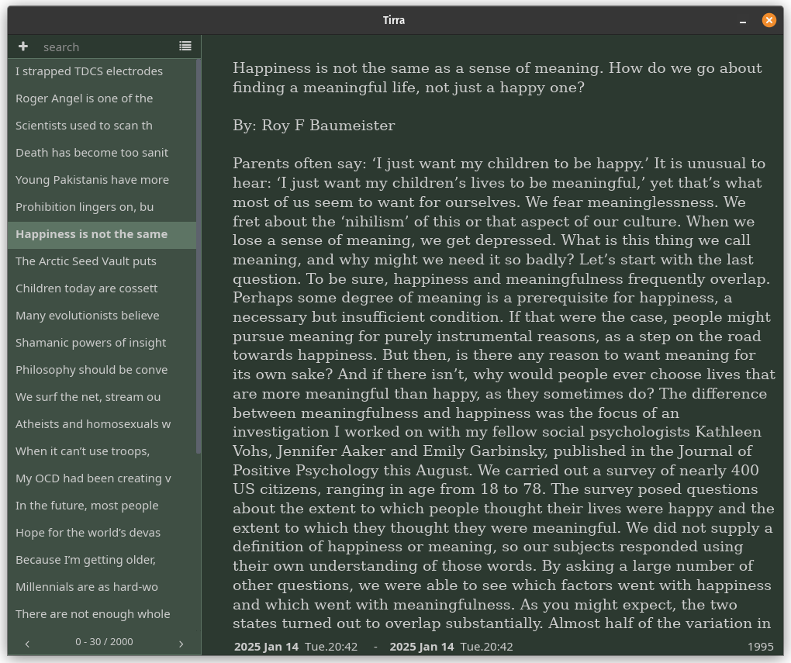

<div align="center">


# Tirra

[](https://github.com/iced-rs/iced/blob/master/LICENSE)

Encrypted Notebook written in Rust.

  <div></div>
  <div></div>

</div>


## Features

* Browse, read, and edit text entries stored in an encrypted SQLite database
* Encryption using age protocol with passphrase. [*Age V1*](https://github.com/FiloSottile/age)
* Open file format (SQLite)
* Database is only decrypted during active use
* Automatic logout after 3 minutes of inactivity
* Full-text search across all entries
* Possibility to edit the currently used SQL query
* Entry deletion
* Sort by creation or modification date (ascending/descending)
* Command-line interface
* Automatic save


## Keyboard Shortcuts

* CTRL + N : start new note.
* CTRL + S : save the current note.
* CTRL + L : switch between light and dark mode.
* CTRL + P : Show/hide SQL request and delete button.
* CTRL + SHIFT + F: Find.

## File Format

SQLite schema V0:

```
TABLE entries (
    id          INTEGER PRIMARY KEY,
    date_create INTEGER NOT NULL,
    date_modify INTEGER NOT NULL,
    type        INTEGER,
    text        BLOB
            )

TABLE information (
    id              INTEGER PRIMARY KEY,
    schema_ver      INTEGER,
    local_commit    BLOB,
    origin_commit   BLOB,
    local_source    BLOB,
    origin_source   BLOB,
    local_ts        INTEGER NOT NULL,
    origin_ts       INTEGER NOT NULL
)
```


+ *type* is the type of the entry, for now it is set to 0 (General Type).
+ *text* is the content of the note. The title is not stored separately and is calculated by the reader from the first sentences.
+ *date_create* and *date_modify* are dates of creation and last modification. They are UNIX epoch timestamps. UTC.
+ *information* table is meant to be used as a basis for synchronization. Any change to the database is recorded in this table. Synchronization is not yet supported


## Platforms

Primarily developed and tested on Linux. Windows and macOS support is experimental.


## Command Line 

``` 
Usage:

$ tirra --cli COMMAND [ARGUMENTS]

tirra --cli ver
tirra --cli add		DB_FILE DATE < INPUT_FILE
tirra --cli delete	DB_FILE ID
tirra --cli stat  	DB_FILE
tirra --cli decrypt	DB_FILE
tirra --cli encrypt	PL_FILE


COMMANDS
       ver    Display the version information and exit.
       add    Add content from a file using redirection. DATE must
              be a Unix epoch timestamp.
       delete Remove an entry from the database by its ID.
       stat   Display statistics about the database.
       decrypt
              Decrypt an encrypted database file.
              it can be used to decrypt any file encrypted using Age/scrypt.
       encrypt
              Encrypt a plaintext database file.
              it can encrypt any file using Age/scrypt.

ARGUMENTS
       DB_FILE
              Path to an encrypted Tirra database file.
       DATE   Unix epoch timestamp.
       DB_FILE_PLAIN
              Path to an plaintext database file.
       ID     id of the entry.
       INPUT_FILE
              A file whose content will be added to the database via
              standard input redirection.
```


## Important Notes

* Temporary Files: If the application closes unexpectedly during encryption/decryption, a plaintext version of the database may temporarily remain on disk (in the same folder as the encrypted file).The Application will emit a warning about it next time it is launched.
* Backup Responsibility: This application does not include automatic backup functionality. Manual backups are recommended.


<div align="center"><a href="https://github.com/iced-rs/iced">
  
</a>
</div>